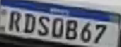
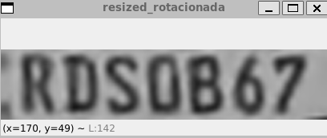
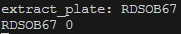
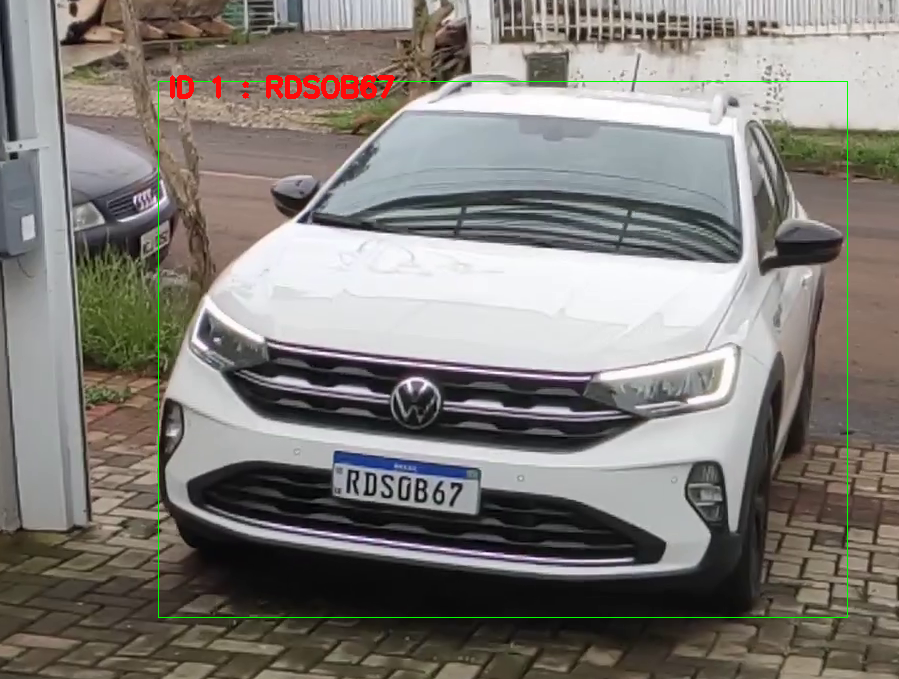

# alpr_track
####  Trabalho de Conclusão de Curso: Protótipo para Controle de Entrada e Saída de Veículos Utilizando Reconhecimento de Placas Veiculares

## Introdução

Neste trabalho de conclusão de curso, abordamos o desenvolvimento de um sistema de reconhecimento de placas veiculares utilizando as tecnologias Tesseract, OpenCV e YOLO em Python. O objetivo foi criar um sistema para identificar e extrair informações de placas de veículos a partir de imagens.


## Utilização 
Construir a imagem do docker
```bash
docker build -t nome_da_sua_imagem .
```

Rodar a imagem com passthrough do display, para mostrar as imagens pelo OpenCV: 

```bash
cd projeto
```
```bash
docker run -v ./:/app -p 8080:8080 --env="DISPLAY" --net=host nome_da_sua_imagem:tag
```
Caso ocorra erro para mostrar o display, tente executar
```bash
export DISPLAY=:0\m
xhost +local:docker 
```

## Tecnologias Utilizadas

- [Tesseract](https://github.com/tesseract-ocr/tesseract): Uma biblioteca de reconhecimento óptico de caracteres.
- [OpenCV](https://opencv.org/): Uma biblioteca de visão computacional.
- [YOLO (You Only Look Once)](https://github.com/ultralytics/yolov5): Um framework de detecção de objetos em tempo real.

## Desenvolvimento

### Pré-processamento das Imagens

Antes de usar utilizar o Tesseract, são utilizados modelos treinados do YOLO para reconhecer veículos e posteriormente (da imagem recortada) placas veiculares para então realizarmos um pré-processamento nas imagens para melhorar a qualidade das placas detectadas.

#### Placa obtida



#### Após o tratamento de escala de cores, binarização, rotacionamento e redimensionamento
 

#### Resultado obtido 
 

#### Resultado visual no frame
 


Para utilizar fora do docker, siga os passos abaixo:

1. Instalar os requisitos do requirements.txt no seu ambiente python, sugiro uma virtual env https://docs.python.org/pt-br/3/library/venv.html
```bash
# Exemplo de código Python usando OpenCV para pré-processamento
pip install -r requirements.txt
```

2. E após, alterar o programa passando sua imagem/video no arquivo main.py na variavel video_path.
```python
video_path = './videos/yourvideo_or_image.mp4'
tracker = SortTracker()
cap = cv2.VideoCapture(video_path)
```
Ou adicionar a leitura de camera pelo OpenCV:
```bash
cv2.VideoCapture(0)
```
3. E por fim chamar a execução do programa
```bash
python main.py
```
